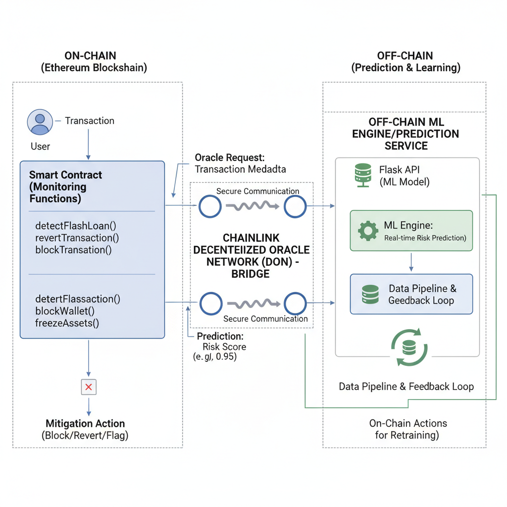

# Fraud Detection in Decentralized Finance (DeFi) Transactions Using ML and Smart Contracts

## Authors

**Harsh Rudrawar** (Lead Author)
Sumitra A. Jakhete
Dhanashree Somani

---

## Overview

Decentralized Finance (DeFi) platforms are increasingly vulnerable to sophisticated fraud mechanisms such as:

* Flash Loan Attacks
* Rug Pulls
* Wallet Compromise
* Phishing Scams
* Malicious Token Activity

Traditional fraud detection approaches are primarily reactive and centralized, making them unsuitable for decentralized ecosystems.

This research proposes a hybrid architecture that combines:

* Off-chain Machine Learning
* Chainlink Decentralized Oracle Networks
* On-chain Smart Contract Enforcement

to enable real-time fraud detection and automated mitigation.

---

## Proposed Architecture

  

The framework consists of three coordinated layers:

### Off-Chain ML Engine

* Data preprocessing
* Feature engineering
* Fraud prediction
* Continuous retraining

### Chainlink Oracle Layer

* Decentralized risk-score transmission
* Secure communication between off-chain and on-chain systems

### On-Chain Smart Contracts

* Transaction monitoring
* Automated fraud mitigation
* Smart contract enforcement

---

## Key Contributions

* Hybrid ML + Blockchain fraud detection framework
* Real-time wallet risk scoring
* Flash-loan attack prevention
* Automated token blacklisting
* Chainlink oracle integration
* Smart contract-based mitigation
* Low-latency response architecture

---

## Experimental Results

| Model               | Accuracy | Precision | Recall | F1 Score |
| ------------------- | -------- | --------- | ------ | -------- |
| XGBoost             | 98.72%   | 96.60%    | 94.81% | 95.70%   |
| Random Forest       | 98.50%   | 98.41%    | 91.48% | 94.82%   |
| Logistic Regression | 85.09%   | 58.33%    | 2.59%  | 4.96%    |

### Operational Performance

| Metric                    | Value      |
| ------------------------- | ---------- |
| Oracle Round-Trip Latency | 1.25 s     |
| Model Inference Time      | 0.43 s     |
| Smart Contract Cost       | 0.0041 ETH |

---

## Publication

Published in:

**2025 IEEE International Conference on Blockchain and Distributed Systems Security (ICBDS)**

Copyright © IEEE.

This repository contains supplementary research material and project information.

---

## Future Work

* Federated Learning for privacy-preserving fraud detection
* Cross-chain fraud analytics
* Explainable AI (XAI)
* Graph Neural Networks
* DAO-governed mitigation policies

---

## Research Interests

* Trustworthy AI
* AI Reliability
* Blockchain Security
* Machine Learning Systems
* Fraud Analytics
